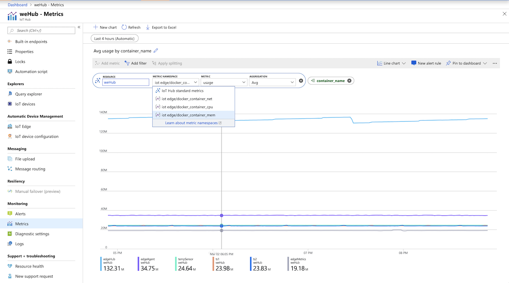
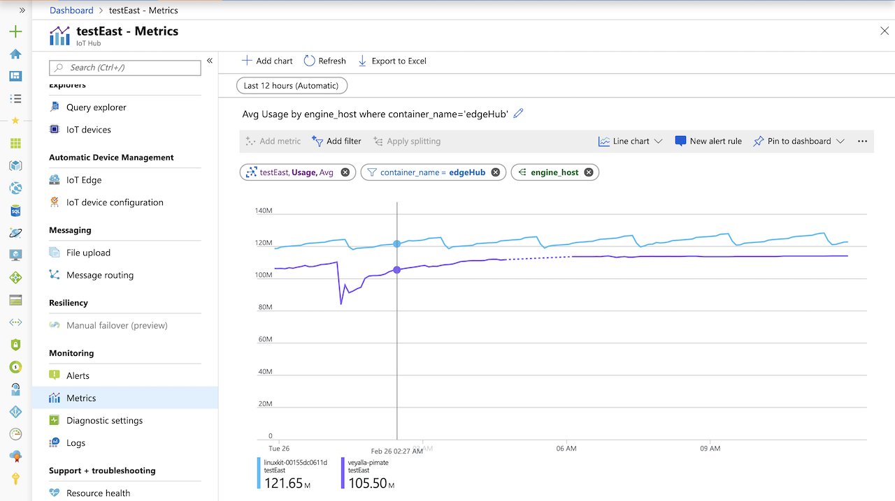

# edge-telegraf-monitor
Visualize and monitor IoT Edge module docker metrics in Azure Monitor using telegraf.

# What it does
Uses [telegraf](https://www.influxdata.com/time-series-platform/telegraf/) agent to send Docker stats from an IoT Edge device to Azure Monitor. As an IoT Edge module, it can to be remotely deployed to devices at scale allowing module CPU, memory and network usage to be monitored centrally in Azure monitor or Grafana (via [Azure Monitor integration](https://docs.microsoft.com/en-us/azure/azure-monitor/platform/grafana-plugin?toc=%2Fazure%2Fazure-monitor%2Ftoc.json)).

# Supported platforms 
Linux amd64 and armhf

# Region availability
The telegraf agent publishes [custom metrics](https://docs.microsoft.com/en-us/azure/azure-monitor/platform/metrics-custom-overview) using the Azure Monitor REST API. Custom metrics are available in these [regions](https://docs.microsoft.com/en-us/azure/azure-monitor/platform/metrics-custom-overview#supported-regions). If the IoT Hub associated with your IoT Edge devices is not in one of these regions, you can create an IoT Hub in the one of the available regions and publish metrics against it even though it doesn't host your Edge devices.

On the device side, https (port 443) outbound access is needed to the [regional](https://docs.microsoft.com/en-us/azure/azure-monitor/platform/metrics-custom-overview#supported-regions) Azure Monitor metrics endpoint. 

# Setup

1. Using the [az cli](https://docs.microsoft.com/en-us/cli/azure/?view=azure-cli-latest ), create a service principal with "Monitoring Metrics Publisher" role for the subscription with the IoT Hub that metrics will be published against (subscription-id can be retrieved using `az account list` or from the Azure portal):

    ```
    az ad sp create-for-rbac --role="Monitoring Metrics Publisher" --scopes="/subscriptions/<replace-with-subscription-id>"
    ```

    On success, the output will look similar to:

    ```
    {
        "appId": "xxx",         // AZURE_CLIENT_ID
        "displayName": "xxx",
        "name": "xxx",
        "password": "xxx",      // AZURE_CLIENT_SECRET
        "tenant": "xxx"         // AZURE_TENANT_ID
    }
    ```

    Note the TENANT_ID, CLIENT_ID and CLIENT_SECRET from the output.

2. Add the telegraf module with the container image built using Dockerfile in this repo.

    Container images from my public repo - `veyalla/telegraf-edge:amd64` and `veyalla/telegraf-edge:armhf` can be used for testing on Linux AMD64 and Linux ARM32 respectively.

    Set the following *createOptions* and environment variable for the modules in the deployment:

    > Settings below are needed only for the telegraf module, no changes are required in other module configuration. If you're using the Portal UI to set the environment variables, you don't need to escape the double-quotes in values for `input_fieldpass` and `input_taginclude`. The Portal will handle that for you.

    ```
    {
        "HostConfig": {
            "Memory": 33554432,
            "Binds": [
            "/var/run/docker.sock:/var/run/docker.sock"
            ]
        }
    }
    ...
    "env": {
        "AZURE_TENANT_ID": {
            "value": "replace-with-tenant-id-from-step1"
        },
        "AZURE_CLIENT_ID": {
            "value": "replace-with-client-id-from-step1"
        },
        "AZURE_CLIENT_SECRET": {
            "value": "replace-with-client-secret-from-step1"
        },
        "resource_id": {
            "value": "replace-with-iot-hub-resouce-id"
        },
        "region": {
            "value": "replace-with-iot-hub-region"
        },
        "input_fieldpass": {
            "value": "\"usage_*\", \"usage\", \"rx_bytes\", \"tx_bytes\""
        },
        "input_taginclude": {
            "value": "\"container_name\", \"engine_host\""
        },
        "interval": {
            "value": "1m"
        }
    }
    ```


    | Environment variable | Description |
    | - | --- |
    | AZURE_TENANT_ID, AZURE_CLIENT_ID, AZURE_CLIENT_SECRET | Credentials from Step 1. |
    | resource_id | IoT Hub resouce ID. Available in the properties page of the IoT Hub in the Portal. Usually of the form `/subscriptions/xxx/resourceGroups/xxx/providers/Microsoft.Devices/IotHubs/<hub-name>.`
    |region | IoT Hub Azure region. Ensure Azure Monitor custom metrics are [supported in region](https://docs.microsoft.com/en-us/azure/azure-monitor/platform/metrics-custom-overview#supported-regions). E.g. westeurope. | 
    | input_fieldpass | Metric fields to include from the [docker input plugin](https://github.com/influxdata/telegraf/blob/master/plugins/inputs/docker/README.md). |
    | input_taginclude | Metric tags to include from the [docker input plugin](https://github.com/influxdata/telegraf/blob/master/plugins/inputs/docker/README.md). This will show up as *dimensions* in Azure Monitor. |
    | interval | Metric publishing [interval](https://github.com/influxdata/telegraf/blob/master/docs/CONFIGURATION.md#intervals). E.g. 30s, 10m, 5h. |

# Viewing metrics
Telegraf *docker* metrics published from Edge devices will appear in the metrics section of the IoT Hub blade in the Azure portal. Once device metrics are pushed to the cloud, you can select Edge metrics from the *Metric Namespace* dropdown. To see metrics across all devices, apply a split along *engine_host*. Similarly, to see metrics across all modules, apply a split along *container_name*. You can add filters to narrow down to a module or device of interest. Here are example screenshots:



